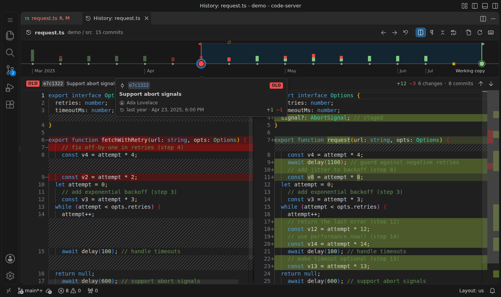

# Diff Slider

Scrub through a file's git history with a slider and watch the diff update as you drag.



Most history tools give you a list of commits. To see how a file changed, you open a commit, find the file, pick "compare with previous" or "compare with working copy", and repeat for the next commit. Diff Slider puts the file's whole history on one timeline above a diff and gives you two handles to drag.

## Using it

Open a file and press **Ctrl+Alt+H** (**⌃⌘H** on macOS). You can also run it from:

- the **Show File History Slider** button (the compare icon) in the editor title bar
- the right-click menu of a file in the Explorer, an editor tab, or the Source Control view
- a commit in the **Timeline** view, which opens the slider on that commit's change
- the Command Palette: **Diff Slider: Show File History Slider**

### The timeline

- **Each dot is a commit that changed this file.** The oldest loaded commit is on the left. Your **working copy** is the diamond on the far right. If the file has staged changes, a **Staged** stop sits just before it.
- **The bar above each commit shows how much it changed** (green for added lines, red for removed), on a log scale so small fixes stay visible next to big rewrites. Commits whose changes are inside the current diff are highlighted.
- Tags show as small tag markers. Month and year labels run along the bottom.
- **Commits that don't change what the diff shows are left out**: ones that only rename the file, change its mode, or convert its line endings. The header says how many are hidden. Uncheck **Content changes only** in the toolbar to put them back on the timeline.

### The two handles

When the slider opens, one handle sits on the **latest commit** and the other on the **working copy**, so you see your uncommitted changes. From there:

- **Drag a handle.** The diff updates live, and a card follows the handle showing the commit's message, author, date, and line counts.
- **Drag the other handle too.** Each handle moves on its own, and they can cross. **Whichever handle is further left is always the _old_ side of the diff** (red), and the right one is the _new_ side (green).
- **Click anywhere on the timeline** to jump the nearest handle there, then keep dragging.
- **Need older history?** Drag a handle to the left end and more commits load as you go. You can also click **‹ Older** (Shift+click loads the entire history). Only the first 50 commits load up front, so the slider opens fast on long histories.

### Other things you can do

- **Double-click a commit** (or use **Show this change** on its card) to see just the change that commit made.
- **Walk the history one commit at a time**: `[` and `]` (or Shift+←/→) move both handles together, keeping the gap between them.
- **Live working copy.** Edits you make to the file, saved or not, show up in the diff as you type.
- **Follows renames.** History continues through `git mv`, and the old side shows the file under its old name.
- **Refreshes itself** when you commit, check out, or stage, even from a terminal.
- **Open in VS Code's own diff editor** (toolbar button or `O`) to get full language features on the same comparison.
- **Open a file at any revision** or **copy a commit SHA** from the commit card.
- Toggle **side-by-side / inline**, **ignore whitespace**, **collapse unchanged regions**, and **word wrap** from the toolbar. Moved code blocks are detected and marked.
- The panel survives a window reload and comes back with the same handles selected.

### Keyboard

| Keys | Action |
| --- | --- |
| ← / → | Move the focused handle one commit |
| Shift + ← / → or `[` / `]` | Move both handles together |
| Home / End | Move the focused handle to the oldest / newest stop |
| Tab | Switch between the two handles |
| `N` / Shift+`N` | Next / previous change in the diff |
| `S` · `W` · `C` · `Z` | Toggle side-by-side · ignore whitespace · collapse unchanged · word wrap |
| `R` | Reset to latest commit ↔ working copy |
| `O` | Open this comparison in the VS Code diff editor |
| `?` | Show the shortcuts |

Clicking the **OLD** or **NEW** label under the timeline focuses that handle.

## Settings

| Setting | Default | |
| --- | --- | --- |
| `diffSlider.pageSize` | `50` | Commits loaded at a time |
| `diffSlider.followRenames` | `true` | Follow history across renames (`git log --follow`) |
| `diffSlider.firstParentOnly` | `false` | Only show first-parent commits, so each merged branch is one step |
| `diffSlider.showStaged` | `true` | Add a **Staged** stop when the file has staged changes |
| `diffSlider.maxFileSizeMB` | `5` | Revisions larger than this aren't loaded |
| `diffSlider.renderSideBySide` | `true` | Side-by-side or inline diff (also a toolbar toggle) |
| `diffSlider.ignoreTrimWhitespace` | `false` | Ignore leading/trailing whitespace (also a toolbar toggle) |
| `diffSlider.hideUnchangedRegions` | `false` | Collapse unchanged regions (also a toolbar toggle) |
| `diffSlider.wordWrap` | `false` | Wrap long lines (also a toolbar toggle) |
| `diffSlider.contentChangesOnly` | `true` | Hide commits that only rename the file, change its mode or convert its line endings (also the **Content changes only** checkbox) |
| `diffSlider.showEditorTitleButton` | `true` | Show the button in the editor title bar |

## Requirements

- VS Code 1.90 or newer
- `git` (the extension uses the same git that VS Code's built-in Git extension uses)

## Limitations

- The diff inside the panel is read-only. Use **Open in VS Code diff editor** to edit or to get language features.
- Syntax highlighting comes from the Monaco editor's built-in grammars. It follows your theme's editor and diff colors, but token colors can differ slightly from your editor's.
- Binary files, and revisions over `diffSlider.maxFileSizeMB`, show a message instead of a diff.
- Merge commits are compared against their first parent.

## Installing

Download the `.vsix` from the [latest release](https://github.com/Andorbal/diff-slider/releases/latest), or from the artifacts of any [Build workflow run](https://github.com/Andorbal/diff-slider/actions/workflows/build.yml), then run `code --install-extension diff-slider-<version>.vsix`.

Builds from the same release share a version number, and VS Code keeps running the old build until you reload the window. If a panel opened after installing says **Diff Slider was updated while this window was open**, reload the window.

To build it yourself:

```sh
npm install
npm run package          # creates diff-slider-<version>.vsix
code --install-extension diff-slider-0.2.1.vsix
```

See [CONTRIBUTING.md](CONTRIBUTING.md) for development and testing.
